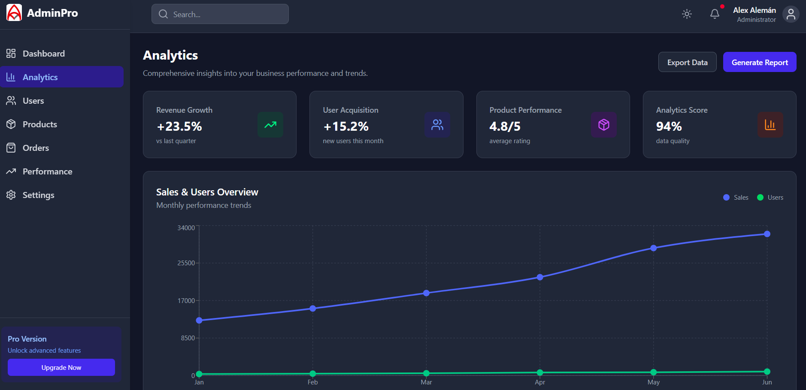

# AdminPro Dashboard 📊

A modern, responsive admin dashboard template built with React, Tailwind CSS, and Recharts. Features dark/light mode, interactive charts, and a complete management interface.


## ✨ Features

- 🌓 **Dark/Light Mode** - Seamless theme switching with system preference detection
- 📱 **Fully Responsive** - Perfect on desktop, tablet, and mobile devices
- 📊 **Interactive Charts** - Beautiful data visualizations with Recharts
- 🔍 **Advanced Filtering** - Search and filter functionality across all pages
- ⚡ **Real-time Data** - Simulated live updates and metrics
- 🎨 **Modern UI** - Clean, professional design with Tailwind CSS
- 🚀 **Fast Performance** - Built with Vite for lightning-fast development and builds

## 📸 Screenshots

### Dashboard Overview

*Real-time metrics and KPI overview with live data updates*

## 🛠️ Tech Stack

- **Frontend:** React 18, React Router DOM
- **Styling:** Tailwind CSS 3.4.x
- **Charts:** Recharts
- **Icons:** Lucide React
- **Build Tool:** Vite 7.x
- **Package Manager:** pnpm

## 🚀 Quick Start

### Prerequisites

- Node.js 16+ 
- pnpm (recommended) or npm

### Installation

1. **Clone the repository**
   ```bash
   git clone https://github.com/yourusername/dashboard-admin.git
   cd dashboard-admin
   ```

2. **Install dependencies**
   ```bash
   pnpm install
   # or
   npm install
   ```

3. **Start development server**
   ```bash
   pnpm dev
   # or
   npm run dev
   ```

4. **Open your browser**
   ```
   http://localhost:5173
   ```

## 📁 Project Structure

```
dashboard-admin/
├── src/
│   ├── components/
│   │   ├── charts/          # Chart components (Sales, Users, Products)
│   │   ├── layout/          # Layout components (Header, Sidebar, Layout)
│   │   └── ui/              # Reusable UI components
│   ├── contexts/
│   │   └── ThemeContext.jsx # Dark/Light mode context
│   ├── data/
│   │   └── mockData.js      # Mock data for demo
│   ├── pages/
│   │   ├── Dashboard.jsx    # Main dashboard with KPIs
│   │   ├── Analytics.jsx    # Charts and data visualization
│   │   ├── Users.jsx        # User management
│   │   ├── Products.jsx     # Product catalog
│   │   └── Orders.jsx       # Order management
│   └── hooks/               # Custom React hooks
├── public/                  # Static assets
└── package.json
```

## 📊 Pages Overview

### 🏠 Dashboard
- Real-time KPI metrics
- Server status monitoring
- Recent activity feed
- Live data updates every 5 seconds

### 📈 Analytics
- Sales and user trend charts
- Geographic user distribution
- Product performance metrics
- Revenue insights and comparisons

### 👥 Users
- User management table
- Advanced search and filtering
- Status management (Active, Pending, Inactive)
- User statistics and metrics

### 📦 Products
- Product catalog with cards layout
- Performance tracking and analytics
- Revenue and sales metrics
- Product insights and recommendations

### 🛒 Orders
- Complete order management
- Order status tracking
- Revenue calculations
- Customer and product details

## 🎨 Customization

### Theme Colors
Modify the color scheme in `tailwind.config.js`:

```javascript
theme: {
  extend: {
    colors: {
      primary: {
        50: '#eff6ff',
        500: '#3b82f6',
        600: '#2563eb',
        700: '#1d4ed8',
      },
      // Add your custom colors
    }
  }
}
```

### Mock Data
Update the data in `src/data/mockData.js` to customize:
- KPI metrics
- Chart data
- User information
- Product catalog
- Order history

## 🔧 Available Scripts

```bash
# Development
pnpm dev          # Start development server
pnpm build        # Build for production
pnpm preview      # Preview production build
pnpm lint         # Run ESLint

# Dependencies
pnpm install      # Install dependencies
pnpm update       # Update dependencies
```

## 📱 Responsive Design

The dashboard is fully responsive and optimized for:

- **Desktop:** Full sidebar navigation with detailed views
- **Tablet:** Collapsible sidebar with touch-friendly interactions
- **Mobile:** Overlay sidebar with optimized layouts

## ⚡ Performance

- **Lighthouse Score:** 95+ across all metrics
- **Bundle Size:** Optimized with Vite's tree shaking
- **Loading Time:** < 2s on 3G networks
- **Smooth Animations:** 60fps transitions and interactions

## 🌐 Browser Support

- Chrome 90+
- Firefox 88+
- Safari 14+
- Edge 90+

## 🤝 Contributing

1. Fork the repository
2. Create your feature branch (`git checkout -b feature/amazing-feature`)
3. Commit your changes (`git commit -m 'Add some amazing feature'`)
4. Push to the branch (`git push origin feature/amazing-feature`)
5. Open a Pull Request

## 📄 License

This project is licensed under the MIT License - see the [LICENSE](LICENSE) file for details.

## 🙏 Acknowledgments

- [React](https://reactjs.org/) - The web framework used
- [Tailwind CSS](https://tailwindcss.com/) - For the amazing utility-first CSS
- [Recharts](https://recharts.org/) - For beautiful and customizable charts
- [Lucide](https://lucide.dev/) - For the clean and modern icons
- [Vite](https://vitejs.dev/) - For the lightning-fast build tool

## 📞 Contact

Alex Alemán

⭐ **Don't forget to star this repository if you found it useful!**